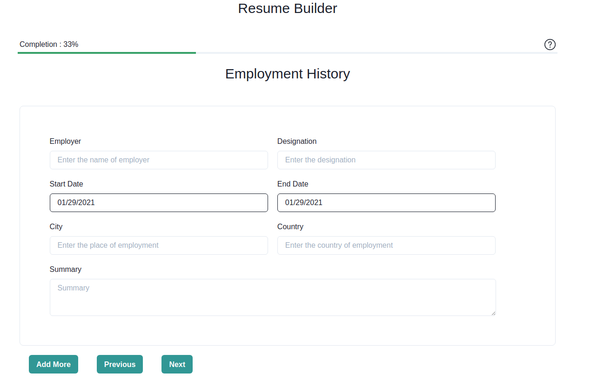

## Resumey

[website](https://resumey-stg.herokuapp.com/)


Online resume builder which lets you build your resume for free. 

## Running Locally

```
export DEV=1
export ALLOWED_HOSTS='*'

python manage.py runserver
```

## Building Frontend
```
yarn && yarn builddev
```

## Screenshot



